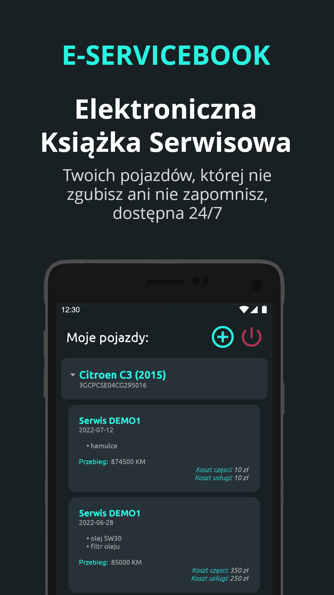
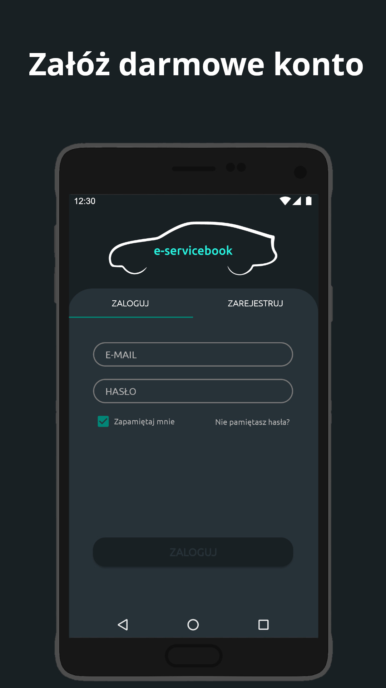
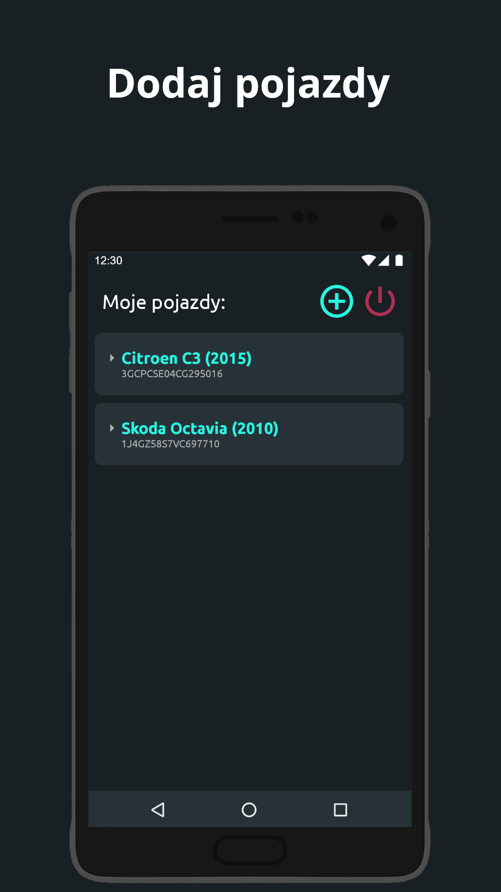
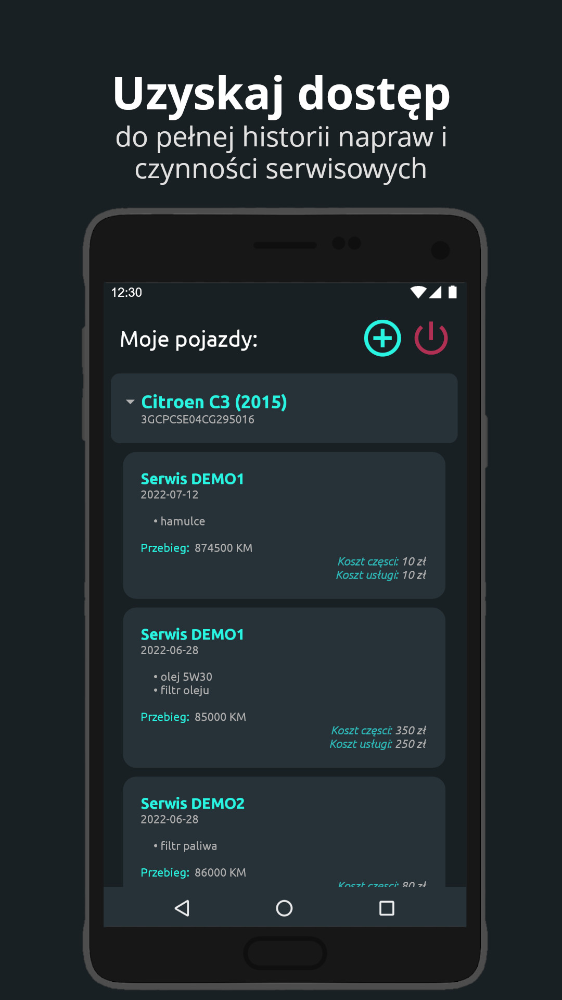

# e-servicebook

**e-servicebook** is an Android app (Java) I developed as part of a commercial startup project.  
The goal was to create a digital service book system for **car owners** and **mechanics**, where repair history and other vehicle-related data could be stored, viewed, and securely transferred between owners.

Although the startup is no longer active and the backend service is unavailable, this repository showcases my ability to build Android applications in Java that connect to remote APIs, handle secure data storage, and provide a clean user interface.

---

## 📱 Screenshots

  
  
  
  

---

## ✨ Features

- User authentication with API integration
- Secure local storage using **EncryptedSharedPreferences (AndroidX Security Crypto)**
- Car history browsing with pull-to-refresh
- Add and manage vehicles linked to user account
- Session management with automatic re-login
- Simple, clean Material Design interface

---

## 🛠️ Tech Stack

- **Language:** Java
- **Frameworks & Libraries:** AndroidX, Material Components, Navigation, LiveData & ViewModel
- **Security:** AndroidX Security Crypto (AES256 encrypted shared preferences)
- **Other:** Custom API integration via `HttpsURLConnection`, Observer pattern for UI updates

---

## ⚠️ Disclaimer

This app was developed a few years ago and is no longer maintained.  
The backend API is not available anymore, so the app cannot be run end-to-end.

---
